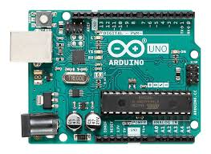

# NFC Payment System

## Introduction

The NFC Payment System uses **Arduino + PN532 NFC** to perform payments by establishing a connection with a smartphone or NFC card. The system is capable of processing and verifying transactions, and is suitable for applications like vending machines or transportation systems.

---

## General Description

### Block Schema


---

## Hardware Design

### List of Parts

- **LCD 1602A**

  

  **LCD 1602A**: The LCD 1602A is a common character display module seen in embedded systems and electronic projects. It has a 16×2 character display, therefore it can show up to 16 characters per line for a total of 32 characters. It interfaces with microcontrollers via a 4-bit or 8-bit parallel interface and is controlled by a Hitachi HD44780 controller.

- **PN532 NFC Module**

  

  Supports ISO/IEC 14443 A/B, FeliCa, and ISO/IEC 15693 standards.

- **ESP-01 (ESP8266 Wi-Fi Module)**

 </p>

**ESP-01**: The ESP-01 is a popular Wi-Fi module based on the ESP8266 chip. It has a small form factor and can be easily integrated into various electronic projects. It supports 802.11 b/g/n Wi-Fi standards and can be programmed using AT commands or with the NodeMCU firmware. It is commonly used in Internet of Things (IoT) applications such as home automation, smart sensors, and remote control systems.


- **Logic Level Shifter**  


**Logic Level Shifter**: A logic level shifter is a versatile circuit that plays a crucial role in bridging the gap between different voltage levels in digital signals. It acts as a compatibility translator, facilitating seamless communication and integration between devices operating at varying logic levels. This enables smooth interaction and ensures efficient data exchange in electronic projects, including those in the realm of Internet of Things (IoT) applications like home automation, smart sensors, and remote control systems.


- **Arduino UNO**  



  **Arduino UNO** - a microcontroller board based on the ATmega328P processor. It is one of the most popular Arduino boards and is intended to be a simple foundation for constructing a variety of electronic projects.

---

## Electrical Schema


---

## Software Design

This app was written using Arduino IDE and Visual Studio Code. The software is divided in 3 parts:

1. Arduino Code
2. ESP (Wifi) Code
3. Web Server

### Arduino


1. First, we include all the libraries we need to use for the project.
   ```cpp
   #include <Wire.h>
   #include <PN532_I2C.h>
   #include <PN532.h>
   #include <NfcAdapter.h>
   #include <LiquidCrystal.h>
   #include <SoftwareSerial.h>
   #include <SerialESP8266wifi.h>
   ```

2. Next, we define the pins of the LCD, NFC, buzzer and ESP01 modules, as noted in the electrical schema.

3. In the setup() function, we initialize the serial communication between Arduino and computer, and between Arduino and ESP01 module, with the baud rate of 115200.

4. We call the initLCD() function, which initialises the LCD screen, the initNFC() function , which turns the NFC module on, and the initWifi() function. which initialises the module. We also send a packet to the server, so that it knows that the Arduino is online.

5. We display on the LCD “Awaiting Transaction”. During this time, we wait for a NFC reading request from the ESP.


6. When a packet is received (a transaction initiated from the web interface), the value of the transaction is displayed on the LCD, along with the indication to tap a payment card to the NFC reader, which is activated.

7. If a card is presented, its information is sent to the server for the processing of the transaction and balance updates.

### ESP (WiFi)

1. First we initialise the Serial connection with the Arduino.

2. We connect to the WiFi network, and send a confirmation packet through the Serial.

3. We create an HTTP server, with the endpoint /pay, which listens for payment requests from the web interface.

4. When a request is received, a reading from the NFC sensor is requested from the Arduino.

5. The reading is send back to the web as a response to the request.

### Web Server

Written in PHP, with a MySQL database.

#### Pages:

- `/` - List of products + admin/login.
- `/buy`, `/pay` - Payment flow via POS.
- `/login`, `/logout`, `/register`, `/account`, `/card` - User/account management.
- `/products` - Product admin.

---
Video: 
[[DEMO](https://www.youtube.com/watch?v=J1LEsm5ILNM)]
---

## Results

- Functional end-to-end NFC transaction handling.
- WiFi-enabled device-server interaction.
- LCD interface for transaction status.

---

## Conclusion

In conclusion, the NFC Payment System project utilizing an Arduino microcontroller, NFC module, and ESP-01 Wi-Fi module successfully demonstrates the implementation of a contactless payment system. The project provides a user-friendly interface through an LCD display and enables communication between the Arduino and a compatible device for initiating and verifying payment transactions.

By leveraging the capabilities of the PN532 NFC controller chip and the logic level shifter, the system ensures reliable communication and compatibility between devices operating at different voltage levels. The integration of the ESP-01 Wi-Fi module enables seamless connectivity and enables the system to interact with web-based interfaces for transaction processing and user management.

Overall, the NFC Payment System project offers a practical and accessible solution for implementing contactless payment functionality in various applications, such as vending machines, transportation systems, and more.


## Resources

- [LCD 1602A Module Wiki](http://wiki.sunfounder.cc/index.php?title=LCD1602_Module)
- [ESP8266wifi Library](https://github.com/ekstrand/ESP8266wifi)
- [PN532 Library](https://github.com/Seeed-Studio/PN532)
- [NDEF Protocol](https://github.com/don/NDEF)

---

##  Reference

From: [ocw.cs.pub.ro/courses/pm/prj2023/apredescu/nfc_system](http://ocw.cs.pub.ro/courses/pm/prj2023/apredescu/nfc_system)
